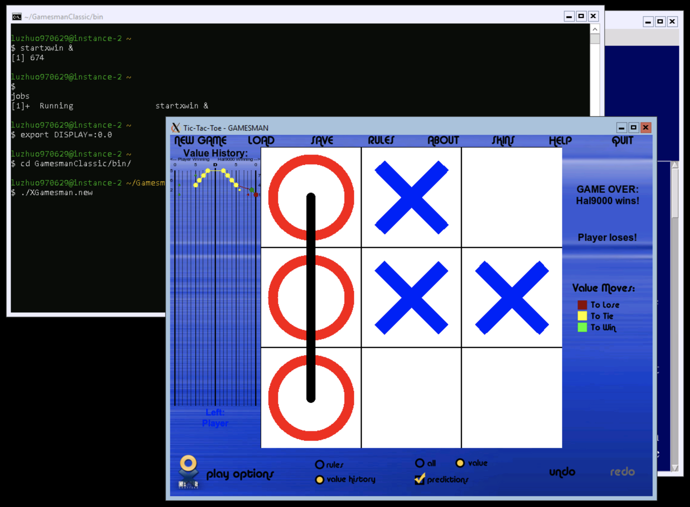

# Build Instructions (Windows)

## Running on `cygwin`

### Prerequisites

- zlib
    - `zlib-devel@v1.2.11-1`
- X11
    - `libX11-devel@v1.6.8-1`
    - `libX11_6@v1.6.8-1`
    - `xinit@1.4.1-1`
- Tcl/Tk
    - `tcl@v8.6.8-1`
    - `tcl-devel@v8.6.8-1`
    - `tcl-tk@v8.6.8-1`
    - `tcl-tk-devel@v8.6.8-1`
- Build Tools
    - `autoconf@v13-1`
    - `autoconf2.5@v2.69-4`
    - `make@v4.2.1-2`
    - `gcc-core@v7.4.0-1`
    - `gcc-g++@v7.4.0-1`
- Misc
    - `git@v2.17.0-1` for cloning the repo
    - `vim@8.1.1772-1` for editing code (opinionated & optional)

### Install `cygwin`

You can download the `cygwin` installer from the website: https://cygwin.com

Make sure to check all the prerequisites listed above when installing `cygwin`. You can run the installation again if you miss any packages while installing for the first time.

After `cygwin` is installed, you can launch a `bash` session using `cygwin`. If you didn't add a shortcut to desktop, you can launch `cygwin` by running `c:\cygwin64\Cygwin.bat` (by default it should launch `bash`).

### Checkout GamesmanClassic

You can check out the GamesmanClassic repo with the following command:

```bash
git clone https://github.com/GamesCrafters/GamesmanClassic.git
```

### Building GamesmanClassic

Follow the below instructions to build GamesmanClassic:

```bash
# Generate configure script
autoconf

# Configure
./configure

# Build GamesmanClassic
make
```

### Run GamesmanClassic with GUI

First, we start the X server in multiwindow mode in the background:

```bash
# The trailing ampersand runs the process in the background
startxwin &

# After the X server starts running, we can verify this by running
jobs # Should say that "startx &" is running

# We also need to let the clients know which X server to connect to
export DISPLAY=:0.0

# Now we're ready to run the GUI!

# Must be in the bin/ directory first
cd bin

# Run the new GUI
./XGamesman.new
```



## Running on Google Cloud Compute Windows Server Instance with `cygwin`

Probably you wonder why you would ever do this?

Assume you've made it to open a remote desktop connection to the compute instance and can see a terminal window.

As you may have probably noticed already, the Windows Server installation is fairly limited graphics-wise and doesn't come with a web browser. Since X11 in `cygwin` requires OpenGL for rendering and Windows Server instances don't really have the GPU-backed graphics library, we opt for a software rendering solution. An open source effort is made available at [@pal1000/mesa-dist-win](https://github.com/pal1000/mesa-dist-win/releases) where we can download pre-built binaries of `mesa`. However, since the releases are all bundled by 7-Zip, we'll need to install 7-Zip before we can unzip the pre-built binaries.

If you're not interested in interacting with the GUI, you may skip the sections on installing 7-Zip and `mesa`.

### Install 7-Zip (Optional, Necessary for Building with GUI)

```cmd
REM In command line...
powershell
```

Now you should be in PowerShell:

```powershell
# In powershell, download mesa binary (feel free to download the latest version)
$client = new-object System.Net.WebClient
$client.DownloadFile("https://www.7-zip.org/a/7z1900-x64.exe","c:\7z-setup.exe")

# Once it's done, we can exit powershell
exit
```

```cmd
REM Now we're back in cmd...

REM You can run the 7-Zip installer with the following command
REM The default install destination should work
start c:\7z-setup.exe
```

### Install `mesa` (Optional, Necessary for Building with GUI)

With 7-Zip installed, we are ready to install `mesa`. Again, we use PowerShell to download the pre-built mesa binary:

```cmd
REM In command line...
powershell
```

Now you should be in PowerShell:

```powershell
# In powershell, download mesa binary (feel free to download the latest version)
$client = new-object System.Net.WebClient
$client.DownloadFile("https://github.com/pal1000/mesa-dist-win/releases/download/19.3.3/mesa3d-19.3.3-release-msvc.7z","c:\mesa.7z")

# Once it's done, we can exit powershell
exit
```

```cmd
REM Now we're back in cmd...

REM Move to C-drive
cd c:\

REM We extract the compressed file with 7-Zip to "c:\mesa\"
"c:\Program Files\7-Zip\7z.exe" x mesa.7z -omesa

REM Run the system-wide deployment script (should open in a new window)
start c:\mesa\systemwidedeploy.cmd

REM Select (1) to install Desktop OpenGL drivers (softpipe and llvmpipe only)

REM After the OpenGL library is deployed, we need one extra tweak for it to work
REM Since cygwin X11 server will look for the OPENGL32.dll quite literally,
REM we need to make sure the shared library is present in System32 directory
copy c:\Windows\System32\mesadrv.dll c:\Windows\System32\OPENGL32.dll 
```

### Install `cygwin`

Now we need to install `cygwin`. We'll download the installer from the command line with PowerShell. In the terminal, type:

```cmd
powershell
```

Now you should be in PowerShell:

```powershell
# In powershell,  download the cygwin setup application
$client = new-object System.Net.WebClient
$client.DownloadFile("https://cygwin.com/setup-x86_64.exe","c:\cygwin-setup.exe")

# Once it's done, we can exit powershell
exit
```

```cmd
REM Now we're back in cmd...

REM You can run the cygwin installer with the following command
start c:\cygwin-setup.exe
```

Once you have the `cygwin` installer up, you may follow the above build instructions for running on `cygwin` to get GamesmanClassic built and running.

Once `cygwin` is installed, you may launch a `bash` (default) session in `cygwin` with the following command:

```cmd
start c:\cygwin64\Cygwin.bat
```
